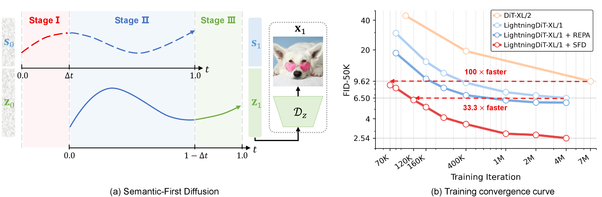
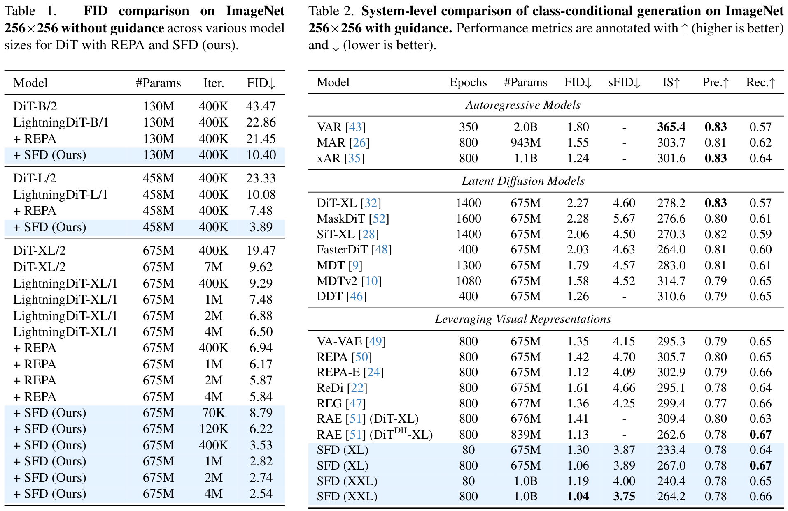

<!-- <h1 align="center"> Semantics Lead the Way: Harmonizing Semantic and Texture Modeling with Asynchronous Latent Diffusion</h1> -->
<h2 align="center">Semantics Lead the Way: Harmonizing Semantic and Texture Modeling with Asynchronous Latent Diffusion</h2>

<p align="center">
<strong>Yueming Pan<sup>1,2‡</sup></strong>, <strong>Ruoyu Feng<sup>3‡</sup></strong>, <strong>Qi Dai<sup>2</sup></strong>, <strong>Yuqi Wang<sup>3</sup></strong>, <strong>Wenfeng Lin<sup>3</sup></strong>, <br>
<strong>Mingyu Guo<sup>3</sup></strong>, <strong>Chong Luo<sup>2†</sup></strong>, <strong>Nanning Zheng<sup>1†</sup></strong>
</p>

<p align="center">
¹IAIR, Xi’an Jiaotong University ²Microsoft Research Asia ³ByteDance  
</p>

<p align="center">
‡ <i>Equal contribution</i> † <i>Corresponding author</i>
</p>


<p align="center">
  <a href="https://arxiv.org/abs/2512.04926"></a>
  <a href="https://yuemingpan.github.io/SFD.github.io/"></a>
  <a href="https://huggingface.co/YuemingPan/SFD"></a>
  <a href="./LICENSE"></a>
</p>

<p align="center">
  
</p>

## ✨ Highlights

- We propose **Semantic-First Diffusion (SFD)**, a novel latent diffusion paradigm that performs asynchronous denoising on semantic and texture latents, allowing semantics to denoise earlier and subsequently guide texture generation.  
- **SFD achieves state-of-the-art FID score of 1.04** on ImageNet 256×256 generation.  
- Exhibits **100×** and **33.3× faster** training convergence compared to **DiT** and **LightningDiT**, respectively.


## 🚩 Overview

<p align="center">
  
</p>

Latent Diffusion Models (LDMs) inherently follow a coarse-to-fine generation process, where high-level semantic structure is generated slightly earlier than fine-grained texture. This indicates the preceding semantics potentially benefit the texture generation by providing a semantic anchor. However, existing methods denoise semantic and texture latents synchronously, overlooking this natural ordering.

We propose **Semantic-First Diffusion (SFD)**, a latent diffusion paradigm that explicitly prioritizes semantic formation. SFD constructs composite latents by combining compact semantic representations from a pretrained visual encoder (via a **Semantic VAE**) with texture latents, and performs asynchronous denoising with separate noise schedules: semantics denoise earlier to guide texture refinement.
During denoising, SFD operates in three phases: 
**Stage I – Semantic initialization**, where semantic latents denoise first;
**Stage II – Asynchronous generation**, where semantics and textures denoise jointly but asynchronously, with semantics ahead of textures;
**Stage III – Texture completion**, where only textures continue refining.
After denoising, only the texture latent is decoded for the final image.

On ImageNet 256×256, **SFD** demonstrates both superior quality and remarkable convergence acceleration.  SFD achieves state-of-the-art **FID 1.06** (LightningDiT-XL) and **FID 1.04** (1.0B LightningDiT-XXL), while exhibiting approximately **100×** and **33.3×** faster training convergence compared to **DiT** and **LightningDiT**, respectively. SFD also improves existing methods like ReDi and VA-VAE, demonstrating the effectiveness of asynchronous, semantics-led modeling.

## 🗞️ News
- **[2026.02.21]**  FlashPortrait is accepted by CVPR2026🎉🎉🎉.
- **[2025.12.05]** Released inference code and pre-trained model weights of SFD on ImageNet 256×256. 
- **[2025.12.21]** Released training code of Semantic VAE and diffusion model (SFD).

## 🛠️ To-Do List

- [x] Inference code and model weights
- [x] Training code of Semantic VAE and diffusion model (SFD)

## 🧾 Results
Explicitly **leading semantics ahead of textures with a moderate offset (Δt = 0.3)** achieves an optimal balance between early semantic stabilization and texture collaboration, effectively harmonizing their joint modeling.
<p align="center">
  
</p>


- On ImageNet 256×256, **SFD** achieves **FID 1.06** (LightningDiT-XL) and **FID 1.04** (1.0B LightningDiT-XXL).  
- **100×** and **33.3×** faster training convergence compared to DiT and LightningDiT, respectively.

<p align="center">
  
</p>


## 🎯 Inference with Pre-Trained Model Weights

### 1. Prepare Environments
```bash
conda create -n sfd python=3.10.12
conda activate sfd
pip install -r requirements.txt
pip install numpy==1.24.3 protobuf==3.20.0
pip install piqa
## guided-diffusion evaluation environment
git clone https://github.com/openai/guided-diffusion.git
pip install tensorflow==2.8.0
sed -i 's/dtype=np\.bool)/dtype=np.bool_)/g' guided-diffusion/evaluations/evaluator.py  # or will encounter the error: "AttributeError: module 'numpy' has no attribute 'bool'".
```

### 2. Prepare Model Weights
```bash
# Prepare the decoder of SD-VAE
mkdir -p outputs/model_weights/va-vae-imagenet256-experimental-variants
wget https://huggingface.co/hustvl/va-vae-imagenet256-experimental-variants/resolve/main/ldm-imagenet256-f16d32-50ep.ckpt \
    --no-check-certificate -O outputs/model_weights/va-vae-imagenet256-experimental-variants/ldm-imagenet256-f16d32-50ep.ckpt

# Prepare evaluation batches of ImageNet 256x256 from guided-diffusion
mkdir -p outputs/ADM_npz
wget https://openaipublic.blob.core.windows.net/diffusion/jul-2021/ref_batches/imagenet/256/VIRTUAL_imagenet256_labeled.npz -O outputs/ADM_npz/VIRTUAL_imagenet256_labeled.npz

# Download files from huggingface
mkdir temp
mkdir -p outputs/dataset/imagenet1k-latents
mkdir -p outputs/train
# Prepare latent statistics
huggingface-cli download SFD-Project/SFD --include "imagenet1k-latents/*" --local-dir temp
mv temp/imagenet1k-latents/* outputs/dataset/imagenet1k-latents/
# Prepare the autoguidance model
huggingface-cli download SFD-Project/SFD --include "model_weights/sfd_autoguidance_b/*" --local-dir temp
mv temp/model_weights/sfd_autoguidance_b outputs/train/
# Prepare XL model (675M)
huggingface-cli download SFD-Project/SFD --include "model_weights/sfd_xl/*" --local-dir temp
mv temp/model_weights/sfd_xl outputs/train/
# Prepare XXL model (1.0B)
huggingface-cli download SFD-Project/SFD --include "model_weights/sfd_1p0/*" --local-dir temp
mv temp/model_weights/sfd_1p0 outputs/train/
rm -rf temp
# or you can directly download the checkpoints from huggingface: https://huggingface.co/SFD-Project/SFD. Put the files in model_weights/ of SFD-Project/SFD to outputs/train
```

### 3. Inference
**Inference demo**
```bash
PRECISION=bf16 bash run_fast_inference.sh $INFERENCE_CONFIG
# take XL model (675M) as an example. 
CFG_SCALE="1.5" \
AUTOGUIDANCE_MODEL_SIZE="b" \
AUTOGUIDANCE_CKPT_ITER="70" \
PRECISION=bf16 bash run_fast_inference.sh configs/sfd/lightningdit_xl/inference_4m_autoguidance_demo.yaml
```
Images will be saved into demo_images/demo_samples.png, e.g. the following one:
<p align="center">
  
</p>

**Inference 50K samples**

For without AutoGuidance, run the following command:
```bash
# w/o AutoGuidance
FID_NUM=50000 \
GPUS_PER_NODE=$GPU_NUM PRECISION=bf16 bash run_inference.sh \
    $INFERENCE_CONFIG

# take XL model (675M) as an example. 
FID_NUM=50000 \
GPUS_PER_NODE=8 PRECISION=bf16 bash run_inference.sh \
    configs/sfd/lightningdit_xl/inference_4m.yaml
```
More inference configs can be found in `configs/sfd/lightningdit_xl` and `configs/sfd/lightningdit_1p0`, corresponding to XL (675M) and XXL (1.0B) models, respectively.

For with AutoGuidance, run the following command:
```bash
# w/ AutoGuidance
CFG_SCALE="$GUIDANCE_SCALE" \
AUTOGUIDANCE_MODEL_SIZE="b" \
AUTOGUIDANCE_CKPT_ITER="$GUIDANCE_ITER" \
FID_NUM=50000 \
GPUS_PER_NODE=$GPU_NUM PRECISION=bf16 bash run_inference.sh \
    $INFERENCE_CONFIG

# take XL model (675M) as an example. 
CFG_SCALE="1.5" \
AUTOGUIDANCE_MODEL_SIZE="b" \
AUTOGUIDANCE_CKPT_ITER="70" \
FID_NUM=50000 \
GPUS_PER_NODE=8 PRECISION=bf16 bash run_inference.sh \
    configs/sfd/lightningdit_xl/inference_4m_autoguidance.yaml
```
More inference configs can be found in `configs/sfd/lightningdit_xl` and `configs/sfd/lightningdit_1p0`, corresponding to XL (675M) and XXL (1.0B) models, respectively. For with AutoGuidance, the detailed parameters for each configuration are shown in the following table:

| Model | Epochs | Params | Degraded Model | Iterations | Guidance Scale |
|-------|--------|--------|----------------|------------|----------------|
| LightningDiT-XL | 80 | 675M | LightningDiT-B | 70K | 1.6 |
| LightningDiT-XL | 800 | 675M | LightningDiT-B | 70K | 1.5 |
| LightningDiT-XXL | 80 | 1.0B | LightningDiT-B | 60K | 1.5 |
| LightningDiT-XXL | 800 | 1.0B | LightningDiT-B | 120K | 1.5 |


### 4.  Evaluation
```bash
# get final scores via guided-diffusion's evaluation tools
bash run_eval_via_guided_diffusion.sh $OUTPUT_IMAGES_DIR
# e.g.,
bash run_eval_via_guided_diffusion.sh outputs/train/sfd_xl/lightningdit-xl-1-ckpt-4000000-dopri5-250-balanced
```
Note that our models were trained and evaluated on 16 NPUs (consistent with the results reported in our paper). When testing on 8 A100 GPUs, we observed minor performance variations. The detailed results are presented below:

**Without AutoGuidance**
| Model | Epochs | #Params | FID (NPU) | FID (GPU) |
|-------|--------|---------|-----------|-----------|
| SFD-XL | 80 | 675M | 3.43 | 3.50 |
| SFD-XL | 800 | 675M | 2.54 | 2.66 |
| SFD-XXL | 80 | 1.0B | 2.84 | 2.92 |
| SFD-XXL | 800 | 1.0B | 2.38 | 2.36 |

**With AutoGuidance**
| Model | Epochs | #Params | FID (NPU) | FID (GPU) |
|-------|--------|---------|-----------|-----------|
| SFD-XL | 80 | 675M | 1.30 | 1.29 |
| SFD-XL | 800 | 675M | 1.06 | 1.03 |
| SFD-XXL | 80 | 1.0B | 1.19 | 1.20 |
| SFD-XXL | 800 | 1.0B | 1.04 | 1.04 |

These slight discrepancies are likely due to numerical precision differences between hardware platforms, but the overall performance remains consistent.


## 🎯 Instruction of Training

### Prepare Training Data
```text
outputs/
└── dataset/
    └── imagenet1k-folder/
        ├── train/
        │   ├── n01440764/
        │   ├── n01443537/
        │   ├── n01484850/
        │   └── ...
        └── val/
            ├── n01440764/
            ├── n01443537/
            ├── n01484850/
            └── ...
```

```bash
# Pre-extract features of DINOv2-B
# Train set (total number is 1281167); 
python tokenizer/semvae/extract_dinov2_feature.py \
    --data_root outputs/dataset/imagenet1k-folder/train \
    --output_root outputs/dataset/imagenet-dinov2/train \
    --model_name dinov2_vitb14_reg \
    --max_samples 1281167 \
    --batch_size 64 \
    --shuffle

# Eval set (For VAE training)
python tokenizer/semvae/extract_dinov2_feature.py \
    --data_root outputs/dataset/imagenet1k-folder/val \
    --output_root outputs/dataset/imagenet-dinov2/val \
    --model_name dinov2_vitb14_reg \
    --max_samples 500 \
    --batch_size 64
```


### Prepare SemVAE and extract features
You can use our provided SemVAE via downloading it from huggingface:
```bash
mkdir -p outputs/semantic_vae
huggingface-cli download SFD-Project/SFD --include "semantic_vae/*" --local-dir outputs
```

or train it by the following command:
```bash
python tokenizer/semvae/train.py --config tokenizer/configs/semvae_train/ch16.yaml
```
Then you can find trained SemVAE in `outputs/semantic_vae/dinov2_vitb14_reg/transformer_ch16`.

Pre-extract features for diffusion model training. Ensure you have space larger than 1TB.
```bash
# change GPU_NUM to the number of GPUs you have
GPUS_PER_NODE=$GPU_NUM bash run_extraction.sh tokenizer/configs/sdvae_f16d32_semvaebasech16.yaml semvae dinov2_vitb14_reg
```

### Train Diffusion Model
```bash
# The diffusion model
GPUS_PER_NODE=$GPU_NUM PRECISION=bf16 bash run_train.sh configs/sfd/lightningdit_xl/train_80ep_lr2e-4.yaml
# The autoguidance model
# Note that this will cover the previous checkpoints in outputs/train/sfd_autoguidance_b
GPUS_PER_NODE=$GPU_NUM PRECISION=bf16 bash run_train.sh configs/sfd/autoguidance_b/train.yaml
```

### Evaluate Trained Model
```bash
FID_NUM=50000 \
GPUS_PER_NODE=$GPU_NUM PRECISION=bf16 bash run_inference.sh \
    configs/sfd/lightningdit_xl/inference_80ep_lr2e-4.yaml

FID_NUM=50000 \
GPUS_PER_NODE=8 PRECISION=bf16 bash run_inference.sh \
    configs/sfd/lightningdit_xl/inference_80ep_lr2e-4_autoguidance.yaml
```
We tested the pipeline and achieved FID 3.23 without guidance and FID 1.38 with guidance on 8 H20 GPU cards.


## Acknowledgements

Our code is based on [LightningDiT](https://github.com/hustvl/LightningDiT), [REPA](https://github.com/sihyun-yu/REPA) and [ADM](https://github.com/openai/guided-diffusion) repositories.  We sincerely thank the authors for releasing their code.  


## 🔗 Citation

If you find our work, this repository, or pretrained models useful, please consider giving a star ⭐ and citing:

```bibtex
@article{Pan2025SFD,
  title={Semantics Lead the Way: Harmonizing Semantic and Texture Modeling with Asynchronous Latent    Diffusion},
  author={Pan, Yueming and Feng, Ruoyu and Dai, Qi and Wang, Yuqi and Lin, Wenfeng and Guo, Mingyu and Luo, Chong and Zheng, Nanning},
  journal={arXiv preprint arXiv:2512.04926},
  year={2025}
}


